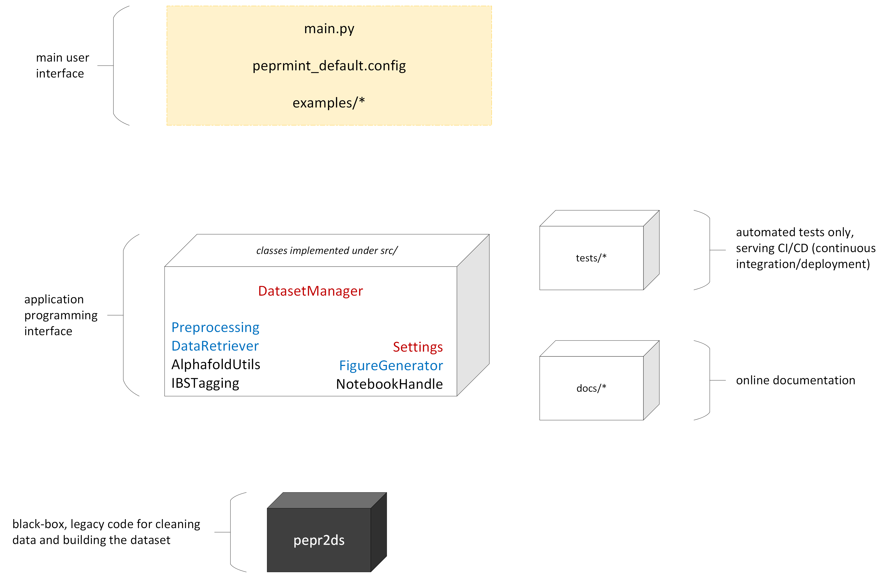

# Different user, different needs

A researcher interested in just using the software without modifying or making extensions to the source code should pay attention to two files only:

1. `peprmint_default.config`
The options here are intuitive and should reflect the desired computation

2. either `main.py` (if one wants to run the execution from a terminal) or `main-nb-example.ipynb` (if one prefers to run within a jupyter notebook)
The uncommented lines here (_i.e._ those not starting with a # character) trigger the different steps of the execution. See the description of the API below for details.

Look also the contents of the `Examples` directory for some usage examples and side applications contributed by different users. By the way: did you draw some nice observation using the software, or just did something cool? **Consider adding your code as an example as well!** Just create a new branch, copy your main script and .config file into `Examples`, and make a pull request. Get in touch if you need help with that!

**Go through the usage tutorial below** to understand the essential tasks executed by the application. If you're a programmer interested in making changes to the source code to suit a particular project needs, it is worth understanding the architecture a bit better;
the different classes and their interfaces are described below under _API_.


# The dataset

The central data structure used throughout this project is a pandas DataFrame containing the following information in each column.

| Column                      | Meaning                                                       | Notes                                                                                |
| --------------------------- | ------------------------------------------------------------- | ----------------------------------------------------------------------------------------------- |
| domain                      | domain name                                                   | \-                                                                                              |
| cathpdb                     | CATH ID                                                       | \-                                                                                              |
| pdb                         | PDB ID                                                        | \-                                                                                              |
| uniprot\_acc                | Uniprot accession number                                      | _e.g._ Q9ULH1                                                                                   |
| uniprot\_id                 | Uniprot ID                                                    | _e.g._ ASAP1\_HUMAN)                                                                            |
| residue\_name               | residue name                                                  | \-                                                                                              |
| IBS                         | interfacial binding sites?                                    | True if residue is part of the IBS, False otherwise                                             |
| chain\_id                   | chain name                                                    | PDB chain ID                                                                                    |
| residue\_number             | residue ID/number                                             | \-                                                                                              |
| b\_factor                   | B-factor of each atom                                         | \-                                                                                              |
| sec\_struc                  | Secondary structure                                           | simplified description                                                                          |
| sec\_struc\_full            | Secondary structure                                           | detailed description                                                                            |
| prot\_block                 | Protein Block                                                 | see [https://github.com/pierrepo/PBxplore](https://github.com/pierrepo/PBxplore) for more info. |
| data\_type                  | source database                                               | whether entry is experimental (cathpdb) or from a model (alphafold)                             |
| Experimental Method         | experiment method for obtaining the structure                 | \-                                                                                              |
| resolution                  | strcuture resolution                                          | 999 if the structure is NMR                                                                     |
| RSA\_total\_freesasa\_tien  | Exposition calculated by the definition of Tien _et al_ 2013  | \-                                                                                              |
| convhull\_vertex            | convex hull flag                                              | residue is part of the convex hull                                                              |
| protrusion                  | protrusion flag                                               | residue is a protrusion                                                                         |
| is\_hydrophobic\_protrusion | hydrophobic protrusion flag                                   | residue is a hydrophobic protrusion                                                             |
| is\_co\_insertable          | co-insertable flag                                            | residue is a co-insertable                                                                      |
| neighboursList              | neighbour residue number list                                 | neighbours list of residue (if it is in the convex hull)                                        |
| density                     | protein density                                               | number of CA/CB in a radius of 1nm                                                              |
| exposed                     | exposition flag                                               | if residue is exposed (RSA >20%) or not (RSA <= 20%)                                            |
| S35                         | Cath cluster number at 35% of identity                        | Cath cluster id. at 35% of seq id.                                                              |
| S60                         | Cath cluster number at 60% of identity                        | Cath cluster id. at 60% of seq id.                                                              |
| S95                         | Cath cluster number at 95% of identity                        | Cath cluster id. at 95% of seq id.                                                              |
| S100                        | Cath cluster number at 100% of identity                       | Cath cluster id. at 100% of seq id.                                                             |
| uniref50                    | Representative uniprot\_acc for cluster with 50% of identity  | representative sequence for protein sequence at 50% of seq id.                                  |
| uniref90                    | Representative uniprot\_acc for cluster with 90% of identity  | representative sequence for protein sequence at 90% of seq id.                                  |
| uniref100                   | Representative uniprot\_acc for cluster with 100% of identity | representative sequence for protein sequence at 100% of seq id.                                 |
| origin                      | Specie of origin                                              | origin of the protein (_e.g._ HUMAN, MOUSE...)                                                  |
| location                    | Location of the protein in the cell                           | \-                                                                                              |
| taxon                       | Taxonomy of the protein                                       | taxonomy at level 0 and 1 of the protein (eucaryote/procaryote etc..)                           |


# Usage tutorial

The organization of this project's repository is illustrated below.



The `DatasetManager` class is the main data structure used throughout most tasks. It depends on an instance of `Settings`, which parses the .config file and allows fine tuning additional superfamilies to use as input, _etc_. The pandas dataframe described above is actually the DATASET attribute of a DatasetManager object.

Through public methods of DatasetManager, we also trigger functionalities from its `AlphafoldUtils` and `IBSTagging` attributes, which take the intuitive responsibilities suggested by the class names.

Important auxiliary features are offered by methods in the `Preprocessing`, `DataRetriever`, and `FigureGenerator` classes. Preprocessing consists essentially of superimposition and rearranging protein structures in space. DataRetriever handles fetching raw data files from databases such as CATH and Prosite. FigureGenerator is only used when all computation is done, and offers several plot options to study properties of the interfacial binding sites (IBS) of entries in the computed dataset.

### Essential steps

1. The `peprmint_default.config` file as it is currently shipped in the repository is suitable for trying and experimenting with the software. **The only suggested change is to set the desired path for storing data**: just fill the _working_folder_path_ key of the first section (`[GENERAL]`). The actual folder should not exist, as the application creates and populates it. For example, setting `working_folder_path = /scratch/cbu/data` means that a new folder _data_ will be created under _/scratch/cbu/_.  NB! Depending on your settings in this file, GBs of information could be created on the given directory. Be aware of possible issues relating to disk capacity, backup tools running in the background, _etc_., and choose a suitable path.

2. On the main script/notebook, it suffices to create a Settings object with
```python
    global_settings = Settings()   # setup reading standard configuration file
```
to initialize the application with the settings in the standard `peprmint_default.config` file. If one chooses to indicate a different configuration file, its path should be given to the Settings constructor:
```python
    global_settings = Settings("/opt/cbu/my.config")  # different config file
```

3. To fetch input data from public databases corresponding to the superfamilies that are active in the current `Settings` object, we then add to the main script/notebook:
```python
    data_retriever = DataRetriever(global_settings)
    data_retriever.fetch()
```
Note that we supply the `Settings` object as argument to the constructor of most classes from here on!

4. The actual IBS tagging methods depend on having the protein structures superimposed in space. So we may as well do that now that we have the raw files. We get an instance of `Preprocessing` and trigger the execution as follows.  
```python
    preprocess = Preprocessing(global_settings)
    preprocess.run(database="cath", verbose=False, use_cath_superpose=False)
```
Here, _database_ could be _cath_ or _alphafold_; we'll use the latter when we already have a dataset and download sequences from AlphaFold models. Also, the standard method uses [TMalign](https://zhanggroup.org/TM-align/) to determine an efficient superimposition quickly (_e.g._ over a thousand PDBs under a minute, using a common laptop). An alternative method using the [cath-superpose](https://cath-tools.readthedocs.io/en/latest/tools/cath-superpose/) tool is also available by setting that argument of the `run` method above to True. This gives an improved, pairwise superimposition, albeit much slower to compute (_e.g._ about seven minutes for 74 PDBs in the small PX superfamily, using a common laptop).

5. With the input data in place, we initialize the main data structure of the project:
```python
    dataset_manager = DatasetManager(global_settings)
    dataset_manager.build()   # build dataset from fetched data
```

This step will take some minutes to complete, as detailed information is extracted from individual PDBs, structural information like protusion and cluster membership is determined, sequence information is downloaded from Uniprot, among other tasks.

The resulting dataset is stored in the object, as well as serialized on the disk as two pickle (_.pkl_) files under _working_folder_path_/`data/dataset`. This allows later runs of the application to quickly restore the dataset by running instead

```python
    dataset_manager = DatasetManager(global_settings)
    #dataset_manager.build()   # build dataset from fetched data
    dataset_manager.load_light_dataset()  # load dataset built on a previous run
```

Lots of interesting information is already available from the pandas dataframe stored on `dataset_manager.DATASET` above. For completeness, though, let us proceed with the essential steps covering the complete usage of the software.

6. Additional sequence information from AlphaFold models is added to the superfamilies and entries available on the current DatasetManager object by calling
```python
    dataset_manager.fetch_alphafold_data()

    preprocess = Preprocessing(global_settings)
    preprocess.run(database="alphafold", verbose=True, use_cath_superpose=False)
    
    dataset_manager.build(recalculate=True)
```
Note that we need to go over the fetch-superimpose-build process again for the AlphaFold data. The fetching process is handled by the `fetch_alphafold_data()` method of DatasetManager itself, since it contains the dataset and hence the complete information about which domains and sequence to download. Superimposition is done again by the instance of `Preprocessing`. When the actual files are in place, we update the dataset manager by calling `build()` again, this time with the _recalculate=True_ option.


7. Finally, we are able to determine the interfacial binding sites (IBS) of all entries in the dataset by calling 
```python
    dataset_manager.add_IBS_data(db="cath+af")   # tag and save merged dataset
```
The _cath+af_ argument indicates that we are to use both the original data (from CATH) and the additional models (from AlphaFold) in tagging the IBS. If one wishes to use only one of these, it suffices to use _db="cath"_ or _db="alphafold"_ as arguments.

An analysis report is exported as well under _working_folder_path_/`figures/report`.

Like the building phase, adding IBS data also serializes the corresponding tagged dataset to a pickle file on the disk, so that later usage may just load the complete information available:
```python
    dataset_manager.load_IBS_data(db="cath+af")   # load from a previous run
```

8. A collection of cool plots to actually analyse the IBS of the superfamilies one is studying can be obtained from the `FigureGenerator` object constructed by our dataset manager:
```python
    figure_gen = dataset_manager.get_figure_generator_after_IBS()
```
Each plot is saved under _working_folder_path_/`figures/article` upon calling the corresponding method of `FigureGenerator`, for instance.
```python
    figure_gen.make_figure_composition_of_exposed_IBS()
    figure_gen.make_figure_protrusions()
    figure_gen.make_figure_composition_for_proteins_with_HP_at_IBS()
    figure_gen.make_figure_neighbourhood_composition()
    figure_gen.make_figure_number_of_structures_w_and_wo_HP_at_IBS()
    figure_gen.make_figure_composition_for_proteins_without_HP_at_IBS()
    figure_gen.make_figure_superfamily_decomposition_exposed_env_HP()
```


___


**TO DO:**
- [x] Dataset description
- [x] Illustration of the repository structure
- [x] Tutorial to run the essential computation steps
- [ ] Description of the API (how?) of all classes
